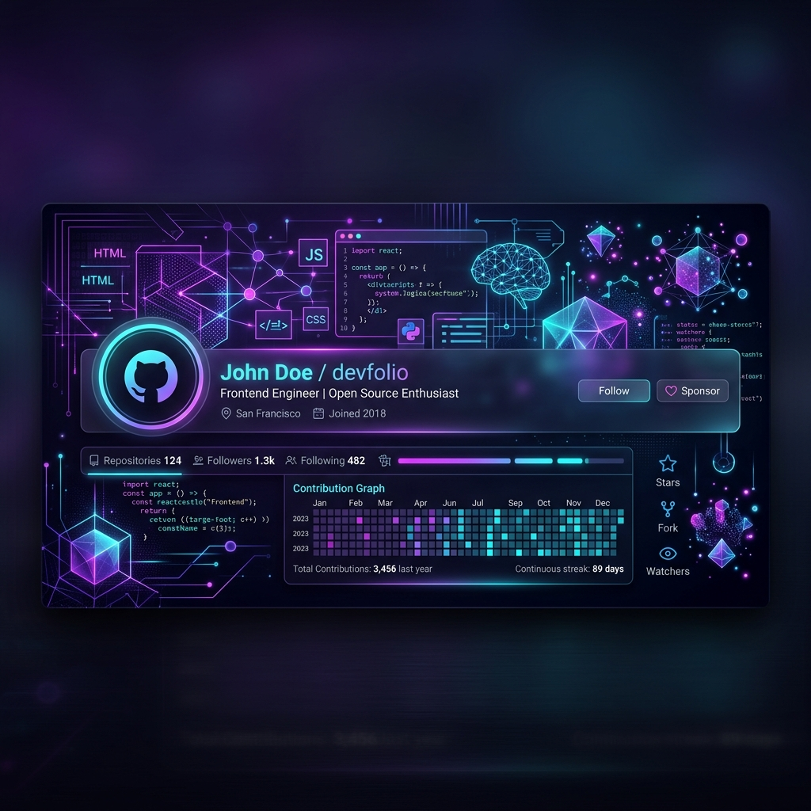

<div align="center">

  <!-- Header Banner -->
  

  <br/><br/>

  <!-- Typing Animated Subtitle -->
  <a href="https://git.io/typing-svg">
    
  </a>

  <p align="center">
    <a href="#-about-me">About Me</a> •
    <a href="#-tech-stack">Tech Stack</a> •
    <a href="#-github-stats">GitHub Stats</a> •
    <a href="#-featured-projects">Projects</a> •
    <a href="#-connect-with-me">Connect</a>
  </p>

  <!-- Visitor Counter Badge -->
  <p align="center">
    
    
    
  </p>

</div>

<hr />

## 🚀 About Me

```typescript
const developer = {
  name: "Vatsal",
  role: "Full-Stack & AI Engineer",
  code: ["JavaScript", "TypeScript", "Python", "Rust"],
  technologies: {
    frontend: ["React", "Next.js", "Tailwind CSS"],
    backend: ["Node.js", "Express", "FastAPI", "PostgreSQL"],
    ai_ml: ["Gemini API", "PyTorch", "LangChain", "Agentic Frameworks"]
  },
  currentFocus: "Building intelligent web apps with autonomous AI agents",
  funFact: "I turn coffee ☕ into clean, maintainable code ⚡"
};
```

* 🔭 **Currently Working On**: Building next-generation web applications powered by generative AI and agentic workflows.
* 🌱 **Learning & Exploring**: Advanced multi-agent orchestration, WebAssembly, and high-performance rust backends.
* 👯 **Open For Collaboration**: Innovative open-source projects, AI tools, and full-stack web applications.
* 💬 **Ask Me About**: React, Next.js, Node.js, Python, System Architecture & AI Integration.
* 📫 **Reach Out**: Drop me a line for inquiries, collaborations, or tech chats!

<br />

## 🛠️ Tech Stack

<div align="center">

### 💻 Languages


### 🎨 Frontend Frameworks & Design


### ⚙️ Backend & Databases


### 🤖 AI, DevOps & Tools


</div>

<hr />

## 📊 GitHub Analytics

<div align="center">

  <!-- GitHub Trophy Showcase -->
  <a href="https://github.com/ryo-ma/github-profile-trophy">
    
  </a>

  <br /><br />

  <!-- Stats & Top Languages Cards Side-by-Side -->
  <table border="0">
    <tr>
      <td width="50%">
        
      </td>
      <td width="50%">
        
      </td>
    </tr>
  </table>

  <!-- Contribution Streak Stats -->
  <br />
  

</div>

<hr />

## ⭐ Featured Projects

| Project | Description | Tech Stack | Links |
| :--- | :--- | :--- | :---: |
| **🤖 AI Agent Workspace** | Autonomous multi-agent development environment for building web apps. | `TypeScript` `React` `Gemini API` | [⭐ Code](https://github.com/vatsalposty01) • [🚀 Demo](#) |
| **⚡ Next.js SaaS Starter** | Production-ready full-stack starter kit with Auth, Payments, & Analytics. | `Next.js` `Tailwind` `PostgreSQL` | [⭐ Code](https://github.com/vatsalposty01) • [🚀 Demo](#) |
| **📊 Real-time Data Analytics** | High-throughput streaming analytics dashboard with interactive charts. | `Node.js` `Redis` `Chart.js` | [⭐ Code](https://github.com/vatsalposty01) • [🚀 Demo](#) |

<hr />

## 🌐 Connect With Me

<div align="center">

  <a href="https://linkedin.com/in/YOUR_LINKEDIN_USERNAME" target="_blank">
    
  </a>
  <a href="https://twitter.com/YOUR_TWITTER_USERNAME" target="_blank">
    
  </a>
  <a href="https://yourportfolio.com" target="_blank">
    
  </a>
  <a href="mailto:your.email@example.com">
    
  </a>

  <br /><br />

  <!-- Daily Developer Quote -->
  

</div>

<br />

<div align="center">
  <sub>Crafted with ❤️ and Agentic AI • Don't forget to ⭐ star your favorite repos!</sub>
</div>
